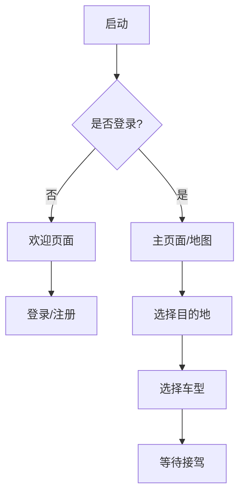

# Koober 应用规格说明

## 1. 项目概述 [WHY]
> 解释为什么需要这个应用，项目背景和动机

### 背景
- 场景: 拟人化动物世界
- 地点: 澳大利亚悉尼
- 目标: 袋鼠打车服务数字化转型

### 业务痛点 [PROBLEM]
> 明确具体要解决的问题
- 现金支付不便
- 无法线上叫车
- 缺乏反馈机制
- 服务质量不稳定

## 2. 核心功能定义 [WHAT]
> 定义解决方案的主要功能模块

### 用户身份
- 乘客注册/登录
- 个人资料管理

### 叫车服务
- 定位服务
- 目的地选择
- 车型选择
- 订单确认

## 3. 用户流程图 [HOW - Flow]
> 展示功能之间如何连接和交互

## 4. 页面状态定义 [HOW - UI]
> 描述具体界面实现和状态

### 关键页面
1. 启动页 (Launch Screen)
   - 功能: 检查登录状态
   - 持续时间: 短暂

2. 欢迎页 (Welcome Screen)
   - 入口: 登录/注册按钮
   - 状态: 未登录

3. 主页面 (Main Screen)
   - 地图展示
   - 当前位置标记
   - "Where to?" 按钮

4. 等待接驾页
   - 订单状态展示
   - 重新叫车选项

## 5. 业务规则 [RULES]
> 定义业务约束和限制条件

### 车型分类
- 袋鼠种类:
  1. 沙袋鼠 (Wallaby): 小型, 价格最低
  2. 硕袋鼠 (Wallaroo): 中型, 价格适中
  3. 大袋鼠 (Kangaroo): 大型, 价格最高

### 系统约束
- 位置服务: 默认返回悉尼
- 测试账号: johnny@gmail.com

## 6. 数据模型 [DATA]
> 定义核心数据结构和关系

### 用户信息
- 邮箱
- 密码
- 个人资料

### 订单信息
- 上车地点
- 目的地
- 选择车型
- 订单状态

## 7. 界面交互规则 [HOW - Action]
> 描述具体的交互方式和流程

### 导航逻辑
- 未登录用户: 限制访问主功能
- 已登录用户: 直接进入地图页面
- 个人资料: 通过顶部按钮访问

### 订单流程
1. 确认位置
2. 选择目的地
3. 选择车型
4. 确认订单
5. 等待接驾

设计意图：
- WHY: 说明项目背景和原因
- WHAT: 定义要做什么
- HOW: 说明具体如何实现（分为Flow/UI/Action三个层面）
- RULES: 定义约束条件
- DATA: 描述数据结构
- PROBLEM: 明确待解决的问题